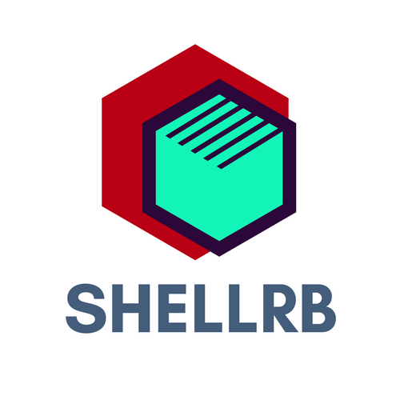

# ShellRB - Unix shell commands using Ruby



[](https://travis-ci.org/faraazahmad/shellrb)
[](https://gitter.im/shellrb/Lobby?utm_source=badge&utm_medium=badge&utm_campaign=pr-badge&utm_content=badge)

ShellRB is a portable **(Windows / Linux / macOS)** implementation of Unix shell commands on top of the Ruby's modules. You can use it to eliminate your shell script's dependency on Unix, while still keeping its familiar and powerful commands.

Inspired from [ShellJS/Shx](https://github.com/shelljs/shx).

## Example
Here's a sneak peek at how it feels to use ShellRB:
```
faraaz@SRB: /home/faraaz> ls
foo
bar
shellrb
...

faraaz@SRB: /> cd home
faraaz@SRB: /home> cd faraaz
faraaz@SRB: /home/faraaz> pwd
/home/faraaz

```

## Why ShellRB
I've been using Linux for my development environment ever since I jumped onto the open-source bandwagon. Often, I've wondered, what would people do if they really wanted to use a Bash-like shell on Windows without the hassle of firing-up a Linux-based OS VM.

Enter ShellRB. The goal is to build a Bash-like shell in Ruby that runs cross-platform, is easy to maintain (has tests for every feature), and is friendly to new contributors.

## Installation
### Prerequisites
1. Make sure you have **Ruby** and **Git** installed (pretty obvious, right?).

  On macOS, Ruby comes pre-installed, on Linux you can install it preferably using [RVM](https://rvm.io), and on Windows, you may have to install Git and Ruby using their installers from [here](https://git-scm.com/download/win) and [here](https://rubyinstaller.org/) respectively.

2. Once you have the above installed, you will also need to install the **`rake` gem**. You can install that using:
  ```
  gem install rake
  ```

### Install ShellRB
1. Clone the repository using Git and `cd` into it:
  ```
  git clone https://github.com/faraazahmad/shellrb.git
  cd shellrb
  ```
2. Install the required gems:
  ```
  rake install
  ```

ShellRB is now installed. You can now run it using:
```
rake run
```

## Updating the gems
To update the gems that ShellRB depends upon, just run:
```
rake update
```

## Updating ShellRB
To get the latest build of ShellRB, (you may have guessed it), simply run:
```
rake upgrade
```

## Contributing
Want to contribute to ShellRB? Great! You can find the contributing guidelines [here](CONTRIBUTING.md).

## Code of Conduct
We highly appreciate good behaviour and kind treatment of others. See our [Code of Conduct](CODE_OF_CONDUCT.md).
